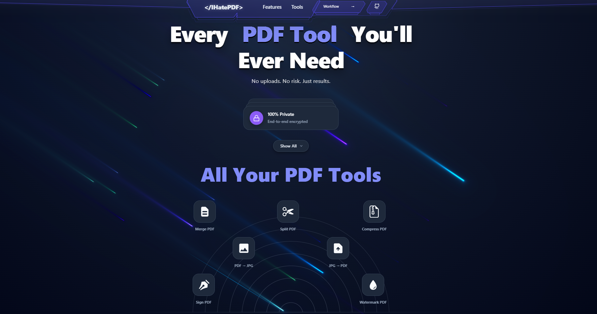

<p align="center">
  
</p>

<h1 align="center">IHatePDF</h1>

<p align="center">
  <b>Privacy-first, lightning-fast PDF toolkit that runs entirely in your browser.</b><br/>
  No uploads. No servers. No sign-up. Works offline.
</p>

<p align="center">
  <a href="https://ihatepdf-ssarthak1357-9069-sarthaks-projects-47c7820b.vercel.app/">
    
  </a>
  &nbsp;
  
  
  
  
</p>

---

## ✨ Top 4 Highlights

### 🔒 1. 100 % Private — Your Files Never Leave Your Device

Unlike traditional PDF services that upload your documents to remote servers, **IHatePDF processes every single file locally inside your browser**. The application has **zero backend** — there is no server, no API endpoint, and no cloud function that ever touches your data. PDF parsing, image rendering, compression, and signing all happen via in-browser JavaScript libraries (`pdf-lib`, `pdfjs-dist`, `jspdf`). This means sensitive contracts, tax documents, and personal IDs remain on your machine at all times, making the tool inherently GDPR-compliant with no data-processing agreement required.

### ⚡ 2. Near-Native Speed — Web Workers + WebAssembly

Heavy PDF operations (rendering pages to high-res images, compressing, merging large files) are offloaded to **dedicated Web Workers** so the main UI thread stays buttery-smooth and fully responsive. Under the hood, `pdfjs-dist` ships its own **WebAssembly (WASM)** binary for parsing and rendering PDF pages at near-native speed. A custom `useWebWorker` React hook abstracts the Worker lifecycle — spawning, posting messages, listening for progress updates, and automatic termination on unmount — so every tool gets non-blocking, parallelised processing out of the box. Large files are fed through a **stream-based chunked reader** (`streamProcessor.js`) that slices files into 1 MB chunks, keeping peak memory consumption low even for 100 MB+ PDFs.

### 📴 3. Works Offline — Install as a PWA

IHatePDF is a full **Progressive Web App** powered by **Workbox** (via `vite-plugin-pwa`). On the first visit, the service worker pre-caches all application assets — HTML, JS bundles, CSS, WASM workers, and even CDN emoji images — so subsequent visits and all PDF operations work **without any internet connection**. The `OfflineIndicator` component detects connectivity changes in real time and reassures users that every tool still functions while offline. You can install the app to your home screen on mobile or desktop and use it like a native application.

### 🚫 4. No Sign-Up — Zero Friction

There are **no accounts, no login walls, no tracking pixels, and no hidden paywalls**. You open the URL (or the installed PWA) and immediately start working. The app stores nothing — no cookies, no analytics, no local-storage tokens — making it one of the few truly friction-free PDF utilities on the web.

---

## 🛠️ Features (Tools)

| Tool | Route | Description |
|---|---|---|
| 📄 **Merge PDF** | `/merge` | Combine multiple PDFs into a single document. Drag to reorder files, cherry-pick individual pages, and preview thumbnails before merging. |
| ✂️ **Split PDF** | `/split` | Extract pages three ways — visual thumbnail picker, typed page ranges, or split every page into its own file. |
| 🗜️ **Compress PDF** | `/compress` | Reduce file size with three compression levels (Maximum, Balanced, Light). Pages are rasterised to JPEG via canvas and re-packed with pdf-lib, always returning the smallest result. |
| 🖼️ **PDF → JPG** | `/pdf-to-jpg` | Convert every page (or a custom range) to high-resolution JPEG images. Choose DPI, quality, and download individually or all at once with live preview. |
| 📸 **JPG → PDF** | `/jpg-to-pdf` | Turn JPG, PNG, WebP, and HEIC images into a polished PDF. Full layout control — page size, fit mode, margins, and image quality with drag-to-reorder. |
| ✍️ **Sign PDF** | `/sign` | Draw, type (four font styles), or upload a PNG signature. Drag to position, resize, set opacity, and embed on any page. |
| 💧 **Watermark PDF** | `/watermark` | Stamp text or image watermarks with full design control — font size, colour, opacity, rotation, and a 3×3 position grid. Preset stamps (DRAFT, CONFIDENTIAL, APPROVED…) for quick use. Apply to all pages, odd/even, first/last, or a custom range with live canvas preview. |

---

## 🧰 Tech Stack

| Layer | Technology |
|---|---|
| **UI Framework** | React 19 with lazy-loaded routes via React Router v7 |
| **Build Tool** | Vite 7 (lightning-fast HMR + optimised production builds) |
| **Styling** | Tailwind CSS 4 + custom Claymorphism design system |
| **PDF Engine** | [`pdf-lib`](https://pdf-lib.js.org/) (create / modify), [`pdfjs-dist`](https://mozilla.github.io/pdf.js/) (render / parse, WASM-backed), `jspdf` (image → PDF) |
| **Concurrency** | Web Workers via custom `useWebWorker` hook |
| **PWA / Offline** | `vite-plugin-pwa` + Workbox (precache + runtime CDN cache) |
| **File Handling** | `react-dropzone` (drag & drop), `file-saver` (downloads), chunked stream reader |
| **Fonts** | `@fontsource` (Dancing Script, Pacifico, Satisfy, Pinyon Script) — fully offline |
| **Icons** | Lucide React + Fluent UI 3D Emoji (CDN-cached offline) |
| **Deployment** | Vercel (zero-config, edge CDN) |

---

## 📂 Project Structure

```
pdf-tool/
├── index.html                  # SPA entry point
├── package.json                # Dependencies & npm scripts
├── vite.config.js              # Vite + PWA + Workbox configuration
├── tailwind.config.js          # Tailwind CSS theme & customisations
├── eslint.config.js            # ESLint flat-config linting rules
├── vercel.json                 # Vercel deployment & SPA rewrite rules
├── image.png                   # Project preview / banner image (shown above)
│
├── public/
│   └── manifest.json           # PWA web-app manifest (name, icons, theme colour)
│
└── src/
    ├── main.jsx                # React DOM root — mounts <App />
    ├── App.jsx                 # Router setup — lazy-loads all 7 tool pages
    ├── App.css                 # Global & clay-morphism styles
    ├── index.css               # Tailwind directives & base resets
    │
    ├── components/
    │   ├── ErrorBoundary.jsx           # Catches rendering errors gracefully
    │   ├── common/
    │   │   ├── FileUploader.jsx        # Drag-and-drop file picker (react-dropzone)
    │   │   ├── Loading.jsx             # Suspense fallback spinner
    │   │   ├── OfflineIndicator.jsx    # Real-time online / offline banner
    │   │   └── ProgressBar.jsx         # Animated processing progress bar
    │   ├── features/
    │   │   └── SignaturePad.jsx        # Canvas-based signature drawing pad
    │   └── layout/                     # Shared layout / navigation shells
    │
    ├── context/
    │   └── AppContext.jsx      # Global state (files, progress, errors) via useReducer
    │
    ├── hooks/
    │   └── useWebWorker.js     # Custom hook — spawns Worker, posts tasks, relays progress
    │
    ├── pages/
    │   ├── Landing.jsx         # Homepage — tool carousel, highlights, feature cards
    │   ├── MergePDF.jsx        # Merge multiple PDFs
    │   ├── SplitPDF.jsx        # Split / extract PDF pages
    │   ├── CompressPDF.jsx     # Compress PDF file size
    │   ├── PDFtoJPG.jsx        # Convert PDF pages → JPEG images
    │   ├── JPGtoPDF.jsx        # Convert images → PDF document
    │   ├── SignPDF.jsx         # Add digital signature to PDF
    │   └── WatermarkPDF.jsx    # Overlay text watermark on PDF pages
    │
    ├── utils/
    │   └── streamProcessor.js  # Chunked file reader for large-file support (1 MB slices)
    │
    └── workers/
        ├── pdfWorker.js        # Web Worker — PDF signing via pdf-lib (background thread)
        └── imageWorker.js      # Web Worker — PDF → JPG rendering (pdfjs-dist WASM + OffscreenCanvas)
```

---

## ⚙️ How Web Workers & WebAssembly Make It Fast

```
┌──────────────────┐       postMessage()        ┌─────────────────────────┐
│                  │  ────────────────────────►  │                         │
│   Main Thread    │      { type, data }        │    Web Worker Thread    │
│   (React UI)     │                            │    (pdfWorker.js /      │
│                  │  ◄────────────────────────  │     imageWorker.js)     │
│                  │  { progress / result / err }│                         │
└──────────────────┘                            └───────────┬─────────────┘
                                                            │
                                                            │  delegates to
                                                            ▼
                                                ┌─────────────────────────┐
                                                │   pdfjs-dist WASM       │
                                                │   (compiled C/C++       │
                                                │    PDF renderer)        │
                                                └─────────────────────────┘
```

### The Problem

PDF parsing, page rendering, and image encoding are **CPU-intensive** tasks. Running them on the browser's main thread would freeze the UI — buttons stop responding, animations stutter, and the browser may show a "page unresponsive" dialog.

### The Solution

| Technique | What It Does | Why It Matters |
|---|---|---|
| **Web Workers** | Run JavaScript in a **separate OS-level thread**, completely isolated from the UI thread. | The React interface stays interactive — progress bars animate, buttons respond, and users can navigate — while heavy PDF work happens in the background. |
| **WebAssembly (WASM)** | `pdfjs-dist` compiles Mozilla's PDF.js core (originally C/C++) into a `.wasm` binary that the browser executes at **near-native speed**. | Rendering complex vector graphics, decoding compressed image streams, and parsing large (100+ page) documents runs **5–10× faster** than equivalent pure-JavaScript code. |
| **`useWebWorker` Hook** | A custom React hook that manages the full worker lifecycle — spawn on mount, post tasks, stream real-time progress, and auto-terminate on unmount. | Every tool page gets non-blocking, parallelised processing with zero boilerplate. |
| **Chunked Stream Processing** | `streamProcessor.js` reads files exceeding 10 MB in **1 MB slices** instead of loading the entire blob into memory. | Keeps the memory footprint predictable and prevents browser tab crashes on very large PDFs. |
| **OffscreenCanvas** | `imageWorker.js` uses `OffscreenCanvas` inside the worker to render PDF pages to JPEG — no DOM access required. | Rendering and JPEG encoding happen entirely off-thread without touching the main-thread canvas pool. |

**The net result:** users get a snappy, responsive UI with real-time progress feedback, even while processing large or complex PDF files — all without a single byte ever leaving their machine.

---

## 🚀 Getting Started

```bash
# Clone the repository
git clone https://github.com/Sarthak-Sahu-1409/ihatepdf.git
cd ihatepdf/pdf-tool

# Install dependencies
npm install

# Start the dev server
npm run dev

# Build for production
npm run build

# Preview the production build locally
npm run preview
```

> **Requirements:** Node.js 18+ recommended.

---

## 🌐 Live Demo

**👉 [https://ihatepdf-ssarthak1357-9069-sarthaks-projects-47c7820b.vercel.app/](https://ihatepdf-ssarthak1357-9069-sarthaks-projects-47c7820b.vercel.app/)**

---

## 📄 License

This project is open-source and available under the [MIT License](LICENSE).

---

<p align="center">
  Built with ❤️ by <strong>Sarthak</strong><br/>
  <sub>No uploads. No risk. Just results.</sub>
</p>
